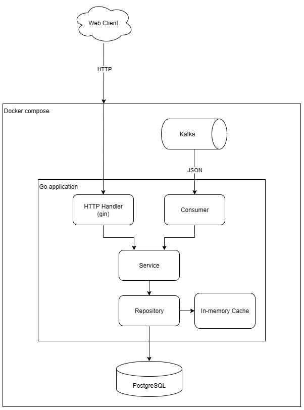

# Демонстрационный сервис с Kafka, PostgreSQL, кешем
Текст задания можно найти [тут](docs/TASK.md).

## 🚀 Использование
Настройка *production* конфигурации сервера:
```bash
сp server/configs/.env.example server/configs/.env.prod # Создание файла конфигурации
nano server/configs/.env.prod # Редактирование файла конфигурации
```

Запуск сервера:
```bash
task compose:up # Запуск docker compose
```

Клиент будет доступен по адресу: `http://localhost:3000/`

Для просмотра заранее подготовленных команд возпользуйтесь командой `task`. 

Кроме того, в директории `server` существует еще один Taskfile. Однако его использование предполагается исключительно для разработки! 


## ⚙️ Backend
### Технологии
* Язык программирования: **Go**
    * HTTP-сервер: **Gin**
    * Логирование: **log/slog**
    * Генерация данных: **Faker**

* Коммуникация: 
    * Брокер сообщений: **Kafka**

* Хранение данных:
    * База данных: **PostgreSQL**
    * Кеш: **In-memory LRU**

* Инфраструктура:
    * Конфигурация: **.env файлы**
    * Контейнеризация: **Docker**
    * Оркестрация: **Docker Compose**

* Интсрументы:
    * Миграции: **goose**
    * Запуск задач: **Taskfile**
    * Live reload: **Air**

## 📐 Архитектура
